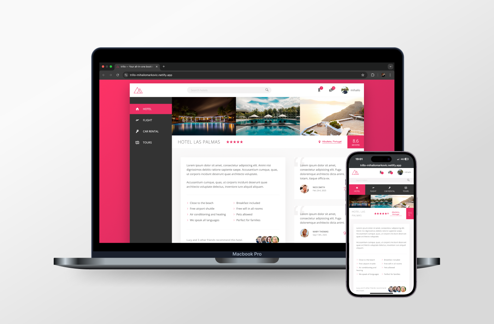

# [Trillo Project 🏝️](https://trillo-mihailomarkovic.netlify.app/)

## Introduction

Welcome to the Trillo Repository, a project created to master CSS flexbox layouts and advanced web design techniques. This project showcases the power and flexibility of flexbox for structuring responsive, user-friendly interfaces. Designed with modern web users in mind, Trillo features elegant layouts, seamless navigation, and visually appealing design elements.

This project serves as a testament to my ability to create clean, responsive, and accessible websites while utilizing CSS and SASS for enhanced styling.

## Project Highlights

- **Flexbox Layouts:** The foundation of this project is built using CSS flexbox, demonstrating the versatility and power of this layout method.
- **Responsive Design:** Adapted for optimal usability across desktops, tablets, and smartphones.
- **Modern Aesthetics:** Incorporates smooth animations and cohesive design elements for a professional appearance.

## What I Learned

This project allowed me to gain hands-on experience in several key areas:

### HTML

- Structuring content logically for readability and SEO.
- Leveraging semantic elements for accessibility and maintainability.

### CSS & SASS

- Creating responsive layouts using flexbox.
- Utilizing SASS to organize and modularize styles effectively.
- Implementing smooth animations and transitions for enhanced interactivity.

### Design Principles

- Applying modern design trends, including clean typography and balanced color schemes.
- Crafting user-centric designs that prioritize ease of navigation and visual appeal.

### Problem-Solving

- Debugging flexbox alignment and responsiveness issues.
- Iteratively improving design based on feedback and testing.

## Project Features

The Trillo website is a visually engaging and interactive project designed to highlight key elements of modern web design:

- **Responsive Layouts:** Adaptable for seamless use on devices of all sizes.
- **Intuitive Navigation:** Includes a user-friendly header and sidebar for streamlined navigation.
- **Dynamic Elements:** Styled with precision to ensure a polished and professional look.

Together, these features demonstrate a thoughtful approach to design and development, blending creativity with technical expertise.

## Technologies Used

- **HTML5:** For semantic, well-structured markup.
- **CSS3:** For styling and animations, leveraging the power of flexbox.
- **SASS:** For better code organization and maintainability.

## Closing Thoughts

The Trillo project showcases my growth as a developer, emphasizing mastery of CSS flexbox layouts and responsive design. It reflects my commitment to building visually appealing and user-friendly web experiences.

Thank you for exploring this repository. Please feel free to check out the code and visit the live site. Your feedback is always welcome!
